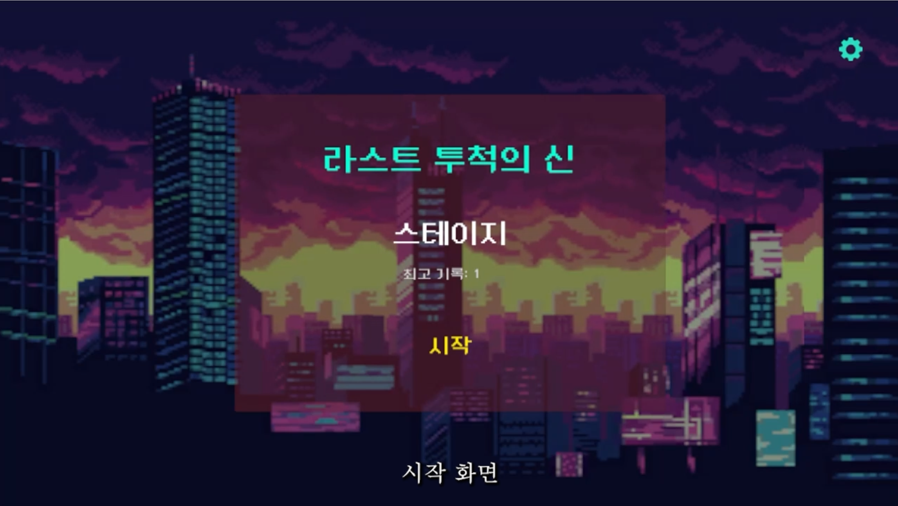
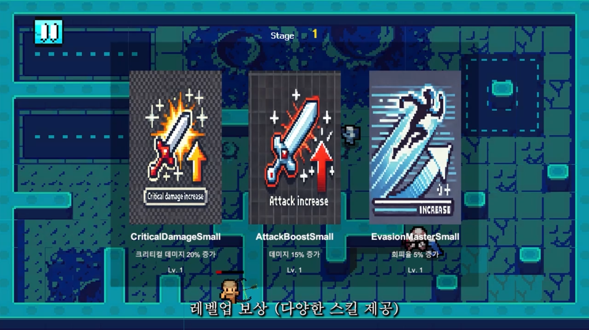
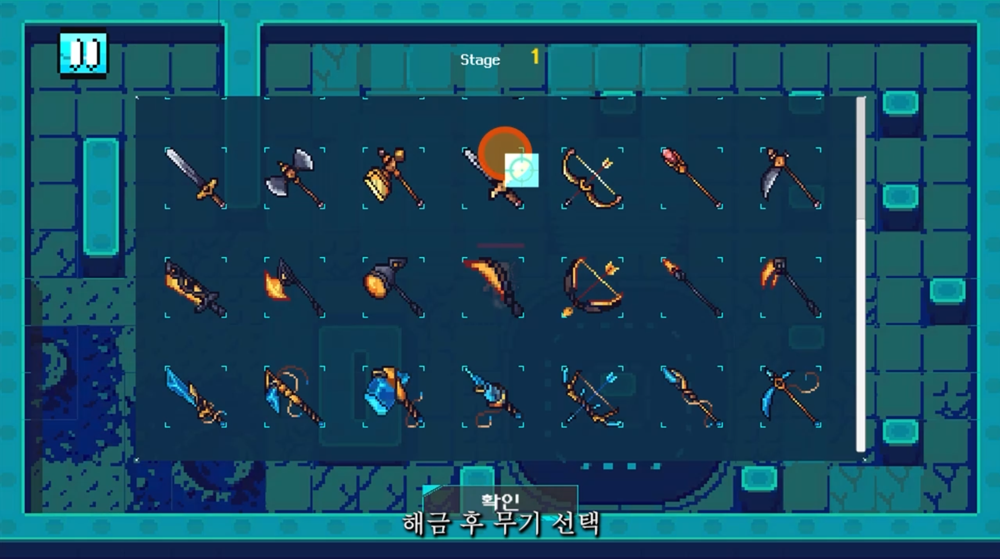
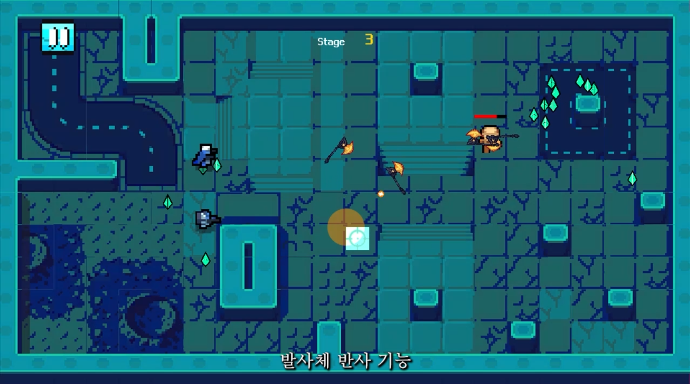

# 라스트 투척의 신

## 소개

**라스트 투척의 신**은 내일배움캠프 팀 프로젝트로 개발된 액션 게임입니다. 플레이어는 다양한 무기와 스킬을 활용하여 적을 처치하고, 여러 스테이지를 클리어하면서 강력한 전사가 되어갑니다.

## 팀원

- **김태호** – 몬스터 구현
- **김성원** – DB 및 맵 디자인
- **김소연** – UI 및 사운드
- **이상훈** – 무기 및 투사체 구현
- **김영중** – 캐릭터 및 스킬 구현

## 주요 기능

### 필수 기능

- 랜덤 방 생성
- 캐릭터 이동 및 공격
- 적 AI 및 공격 패턴
- 스킬 및 업그레이드 시스템
- 스테이지 클리어
- 게임 빌드 및 배포

### 도전 기능

- 배경 음악 및 사운드 효과 추가
- 발사체 반사 기능 구현
- 간단한 게임 시작 화면

## 설치 및 실행 방법

### 1. 프로젝트 클론

```
git clone <repository-url>
cd last-throw-god
```

### 2. 필요한 패키지 설치

```
# Unity 프로젝트 설정 후 필요 패키지 설치
```

### 3. 실행 방법

Unity에서 프로젝트를 열고 실행 버튼을 눌러 게임을 시작합니다.

## 와이어 프레임


## 게임 화면










## 기여 방법

1. Fork 및 Pull Request를 통해 코드 기여 가능
2. 이슈를 생성하여 버그 및 개선점 공유

## 라이선스 및 출처

- 활: [링크](https://spartacodingclub.kr/blog/618cbaaf94295eb6f7fff0f2)
- 무기 에셋: [링크](https://babysamurai.itch.io/super-epic-fantasy-weapons-pack)
- UI 에셋: [링크](https://wenrexa.itch.io/kit-nesia2), [링크](https://srtoasty.itch.io/ui-assets-pack-2)
- 맵 디자인: [링크](https://mattwalkden.itch.io/free-robot-warfare-pack)
- 아이템: [링크](https://ghostpixxells.itch.io/pixel-mart)

## 문의

추가 문의 사항은 GitHub Issues 또는 팀원에게 연락 주세요.
